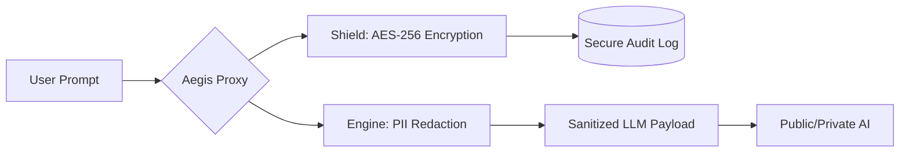

<div align="center">
  <h1>🛡️ Aegis Proxy</h1>
  <h3>Enterprise AI Security Gateway & PII Interceptor</h3>
  <p><b>Role:</b> AI Solutions Architect & Security Engineer</p>
  <p><b>Architecture:</b> Triple Threat • Zero Trust • GRC-Compliant</p>
</div>

<br />

## 🧠 Executive Summary
The **Aegis Proxy** is a high-performance security interceptor designed to solve the "AI Data Leakage" crisis. As organizations integrate Large Language Models (LLMs) into their workflows, sensitive PII (Personally Identifiable Information) is often leaked into public training sets. This platform intercepts user prompts, sanitizes sensitive data in real-time, and secures raw evidence via **AES-256 encryption**, transforming AI from a liability into a secure enterprise asset.

---

## 🏗️ The "Triple-Threat" Architecture

| 1. The Engine 🤖 | 2. The Shield 🛡️ | 3. The Strategy ⚖️ |
| :--- | :--- | :--- |
| **AI Data Intelligence** | **Information Security** | **GRC & Governance** |
| • **PII Scrubbing:** Detects SSNs, Emails, and Credit Cards. | • **Evidence Vaulting:** AES-256 symmetric encryption. | • **Non-Repudiation:** Defensible audit trail for GRC. |
| **Contextual Redaction** | **AES-256 Encryption** | **Admin Dashboard** |
| • Scans text via `spaCy` (Large). | • Encrypts logs via Fernet. | • **Streamlit UI** for real-time monitoring. |

<br />

## 🚀 Technical Flow (The Build)


<br />

## 🛠️ Quick Start
1. **Initialize Environment:**
  ```powershell
   py -3.12 -m venv venv
   .\venv\Scripts\activate
   pip install -r requirements.txt
   python -m spacy download en_core_web_lg
  ```

2. **Launch Aegis Dashboard:
  streamlit run app.py

### 3. 🛠️ Tech Stack

<p align="left">
  
  
  
  
</p>

<div align="center"> <i>"Security is not a blocker; it is the architecture that allows the business to scale AI safely."</i> <br /> <b>Designed & Architected by Christopher Finnerty - 2025</b> </div>
